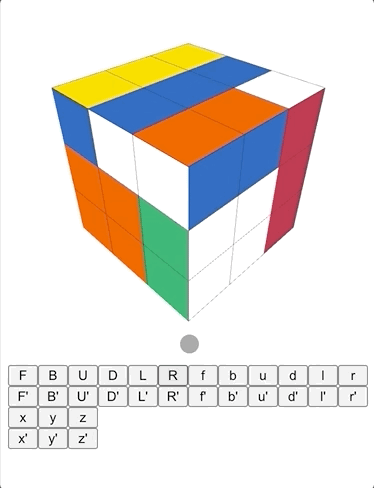

# Rubik's Cube
A web based Rubik's Cube implementation. The goal of this package was to provide a minimal interface to the rendered Rubik's cube that would allow consumers to implement custom UI elements and build upon the provided functionality.

## Features
* 3D rendered Rubik's Cube
* Singmaster notation methods
* Configurable rotation speed
* Responsive canvas



## Installation
```
yarn add @curtishughes/rubiks-cube
```

```
npm install @curtishughes/rubiks-cube
```

## Usage
The project's [api documentation](https://curtishughes.github.io/rubiks-cube/) is generated in the `docs` directory via [typedoc](https://typedoc.org/) and hosted with github pages.

*Rubik's Cube* is not coupled with any specific framework. However, I have included some examples of how it can be used with a few of the popular frontend frameworks:

### React
```tsx
import React, { useRef, useEffect, useState } from 'react';
import { RubiksCube } from '@curtishughes/rubiks-cube';

function App() {
  const canvasRef = useRef<HTMLCanvasElement>(null);
  const [cube, setCube] = useState<RubiksCube>();

  useEffect(() => {
    if (canvasRef.current) {
      setCube(new RubiksCube(canvasRef.current, 100));
    }
  }, []);

  return (
    <>
      <canvas width="200px" height="200px" ref={canvasRef} />
      <button onClick={() => { if (cube) cube.F() }}>F</button>
      <button onClick={() => { if (cube) cube.F(false) }}>F'</button>
      <button onClick={() => { if (cube) cube.B() }}>B</button>
      <button onClick={() => { if (cube) cube.B(false) }}>B'</button>
      <button onClick={() => { if (cube) cube.U() }}>U</button>
      <button onClick={() => { if (cube) cube.U(false) }}>U'</button>
      <button onClick={() => { if (cube) cube.D() }}>D</button>
      <button onClick={() => { if (cube) cube.D(false) }}>D'</button>
      <button onClick={() => { if (cube) cube.L() }}>L</button>
      <button onClick={() => { if (cube) cube.L(false) }}>L'</button>
      <button onClick={() => { if (cube) cube.R() }}>R</button>
      <button onClick={() => { if (cube) cube.R(false) }}>R'</button>
      <button onClick={() => { if (cube) cube.f() }}>f</button>
      <button onClick={() => { if (cube) cube.f(false) }}>f'</button>
      <button onClick={() => { if (cube) cube.b() }}>b</button>
      <button onClick={() => { if (cube) cube.b(false) }}>b'</button>
      <button onClick={() => { if (cube) cube.u() }}>u</button>
      <button onClick={() => { if (cube) cube.u(false) }}>u'</button>
      <button onClick={() => { if (cube) cube.d() }}>d</button>
      <button onClick={() => { if (cube) cube.d(false) }}>d'</button>
      <button onClick={() => { if (cube) cube.l() }}>l</button>
      <button onClick={() => { if (cube) cube.l(false) }}>l'</button>
      <button onClick={() => { if (cube) cube.r() }}>r</button>
      <button onClick={() => { if (cube) cube.r(false) }}>r'</button>
      <button onClick={() => { if (cube) cube.x() }}>x</button>
      <button onClick={() => { if (cube) cube.x(false) }}>x'</button>
      <button onClick={() => { if (cube) cube.y() }}>y</button>
      <button onClick={() => { if (cube) cube.y(false) }}>y'</button>
      <button onClick={() => { if (cube) cube.z() }}>z</button>
      <button onClick={() => { if (cube) cube.z(false) }}>z'</button>
    </>
  );
}

export default App;
```

### Vue
```vue
<template>
  <div>
    <canvas ref="cube" />
    <button @click="() => cube.F()">F</button>
    <button @click="() => cube.F(false)">F'</button>
    <button @click="() => cube.F()">F</button>
    <button @click="() => cube.F(false)">F'</button>
    <button @click="() => cube.B()">B</button>
    <button @click="() => cube.B(false)">B'</button>
    <button @click="() => cube.U()">U</button>
    <button @click="() => cube.U(false)">U'</button>
    <button @click="() => cube.D()">D</button>
    <button @click="() => cube.D(false)">D'</button>
    <button @click="() => cube.L()">L</button>
    <button @click="() => cube.L(false)">L'</button>
    <button @click="() => cube.R()">R</button>
    <button @click="() => cube.R(false)">R'</button>
    <button @click="() => cube.f()">f</button>
    <button @click="() => cube.f(false)">f'</button>
    <button @click="() => cube.b()">b</button>
    <button @click="() => cube.b(false)">b'</button>
    <button @click="() => cube.u()">u</button>
    <button @click="() => cube.u(false)">u'</button>
    <button @click="() => cube.d()">d</button>
    <button @click="() => cube.d(false)">d'</button>
    <button @click="() => cube.l()">l</button>
    <button @click="() => cube.l(false)">l'</button>
    <button @click="() => cube.r()">r</button>
    <button @click="() => cube.r(false)">r'</button>
    <button @click="() => cube.x()">x</button>
    <button @click="() => cube.x(false)">x'</button>
    <button @click="() => cube.y()">y</button>
    <button @click="() => cube.y(false)">y'</button>
    <button @click="() => cube.z()">z</button>
    <button @click="() => cube.z(false)">z'</button>
  </div>
</template>

<script lang="ts">
import { Component, Vue } from 'vue-property-decorator';
import { RubiksCube } from '@curtishughes/rubiks-cube';

@Component
export default class Editor extends Vue {
  private cube!: RubiksCube;

  mounted() {
    const canvas = this.$refs.cube as HTMLCanvasElement;
    this.cube = new RubiksCube(canvas, 100);
  }
}
</script>
```

## License
MIT License

Copyright (c) [2021] [Curtis Hughes]

Permission is hereby granted, free of charge, to any person obtaining a copy
of this software and associated documentation files (the "Software"), to deal
in the Software without restriction, including without limitation the rights
to use, copy, modify, merge, publish, distribute, sublicense, and/or sell
copies of the Software, and to permit persons to whom the Software is
furnished to do so, subject to the following conditions:

The above copyright notice and this permission notice shall be included in all
copies or substantial portions of the Software.

THE SOFTWARE IS PROVIDED "AS IS", WITHOUT WARRANTY OF ANY KIND, EXPRESS OR
IMPLIED, INCLUDING BUT NOT LIMITED TO THE WARRANTIES OF MERCHANTABILITY,
FITNESS FOR A PARTICULAR PURPOSE AND NONINFRINGEMENT. IN NO EVENT SHALL THE
AUTHORS OR COPYRIGHT HOLDERS BE LIABLE FOR ANY CLAIM, DAMAGES OR OTHER
LIABILITY, WHETHER IN AN ACTION OF CONTRACT, TORT OR OTHERWISE, ARISING FROM,
OUT OF OR IN CONNECTION WITH THE SOFTWARE OR THE USE OR OTHER DEALINGS IN THE
SOFTWARE.
